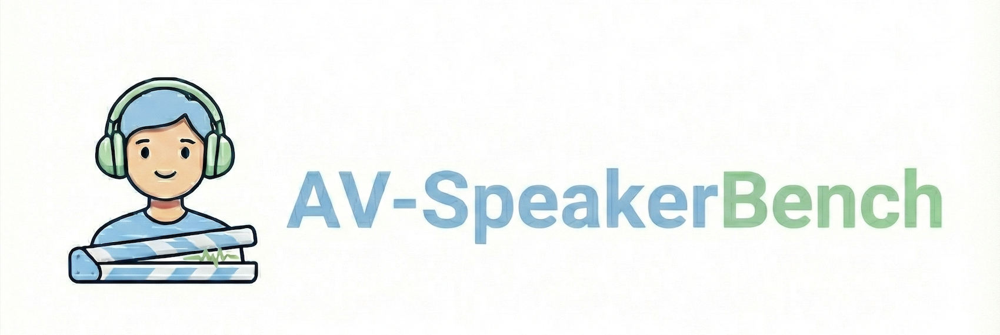
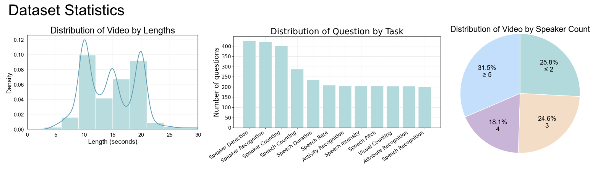
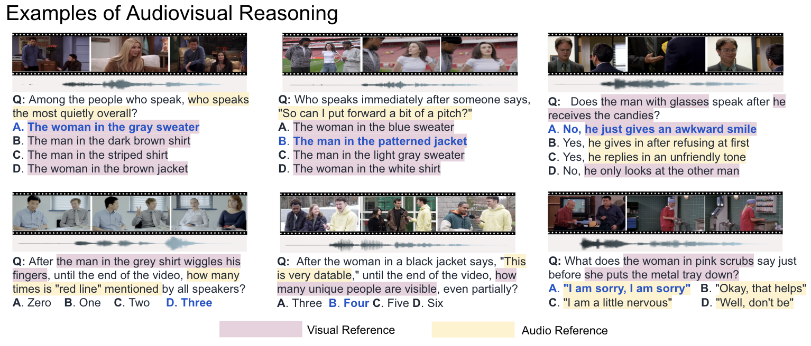

<div align="center" style="margin-bottom: 16px;">
  <h1 style="margin: 0; font-size: 34px; font-weight: 800; line-height: 1.25;">
    See, Hear, and Understand: Benchmarking Audiovisual Human Speech Understanding in Multimodal Large Language Models
  </h1>
</div>

[Le Thien Phuc Nguyen*](https://plnguyen2908.github.io/), [Zhuoran Yu*](https://www.zhuoranyu.com/), Samuel Low Yu Hang, Subin An, Jeongkik Lee, Yohan Ban, SeungEun Chung, [Thanh-Huy Nguyen](https://www.linkedin.com/in/antares0811/), Juwan Maeng, [Soochahn Lee](https://sites.google.com/view/soochahnlee/), [Yong Jae Lee](https://pages.cs.wisc.edu/~yongjaelee/) (* equal contribution)

<p align="center" style="width: 100%;">
  
</p>
<p align="center">
  <a href="https://plnguyen2908.github.io/AV-SpeakerBench-project-page/"><span aria-hidden="true">&#127760;</span> Project Page</a> |
  <a href="https://arxiv.org/abs/2512.02231"><span aria-hidden="true">&#128214;</span> ArXiv</a> |
  <a href="https://huggingface.co/datasets/plnguyen2908/AV-SpeakerBench"><span aria-hidden="true">&#129303;</span> Dataset</a> |
  <a href="https://plnguyen2908.github.io/AV-SpeakerBench-project-page/#leaderboard"><span aria-hidden="true">&#127942;</span> Leaderboard</a>
</p>

---

## Announcements

- 2026-03-15: AV-SpeakerBench has been integrated into [VLMEvalKit](https://github.com/open-compass/VLMEvalKit/pull/1393)! You can run both reasoning models and non-reasoning models on VLMEvalKit!
- 2026-01-26: For thinking models, please make sure that you do the parsing to output a single character while using [lmms-eval](https://github.com/EvolvingLMMs-Lab/lmms-eval/tree/main/lmms_eval/tasks/av_speakerbench). If you use our codebase, it is fine since we takes the last "A,B,C,D" character from your response.
- 2025-12-30: AV-SpeakerBench has been integrated into [lmms-eval](https://github.com/EvolvingLMMs-Lab/lmms-eval/tree/main/lmms_eval/tasks/av_speakerbench)

TL;DR: AV-SpeakerBench evaluates multimodal large langague models (MLLMs) on speakers conversation understanding audiovisually.

## Contents
- [Overview](#overview)
- [Environment Setup](#environment-setup)
- [Data](#data)
- [Quick Eval](#quick-eval)
- [Add Your Model](#add-your-model)
- [Add your model to the leaderboard](#add-your-model-to-the-leaderboard)
- [Outputs](#outputs)
- [Agent Docs](#agent-docs)
- [Citation](#citation)

## Repository layout (baseline vs agent fork)

Benchmark **code** lives under **`baseline/`**; the **multimodal Agent** study (Skills, Tools, orchestration) lives under **`agent/`**. The checklist-style design note is **[`agent/docs/MM_AGENT_DESIGN.md`](agent/docs/MM_AGENT_DESIGN.md)**.

For agent-side external-tool planning, see **[`agent/docs/AV_TOOL_SKILL_SURVEY.md`](agent/docs/AV_TOOL_SKILL_SURVEY.md)**.

**Dataset clips and `test.csv` stay at [`Holistic_AVQA_bench/`](Holistic_AVQA_bench/) beside `baseline/`** (repository root default), unless you override with **`AV_SPEAKERBENCH_DATA_ROOT`** or **`--data_path`**.

| Path | Role |
|------|------|
| `baseline/` | Frozen-style AV-SpeakerBench harness ([`baseline/README.md`](baseline/README.md)). |
| `agent/` | Agent track: full eval copy + [`orchestrator/`](agent/orchestrator/), traces, prefixed artifacts — see [`agent/README.md`](agent/README.md). |
| `Holistic_AVQA_bench/` | Default dataset root (unchanged layout). |

You can launch **baseline** eval from repo root (**`python main.py ...`** → `baseline/`) or **`cd baseline && python main.py ...`**.

For the **agent** harness: **`python main_agent.py ...`** (repo root) or **`cd agent && python main.py ...`**.

## Overview

AV-SpeakerBench is a curated benchmark of 3,212 multiple-choice questions that tests speaker-centric audiovisual reasoning in real-world videos. Unlike prior video datasets where many tasks are visually solvable or only loosely tied to speech, AV-SpeakerBench explicitly evaluates whether models can align who speaks, what is said, and when it happens. Questions are written with fusion-grounded semantics (audio–visual anchors) and expert-curated annotations to ensure temporal and cross-modal correctness. Initial results show that Gemini 2.5 Pro leads overall performance, while the gap between Gemini and strong open models such as Qwen3-Omni-30B highlights persistent weaknesses in audiovisual fusion.


<p align="center" style="width: 100%;">
  
</p>


- **Clip length** – Videos are short, natural clips (mostly under ~25 seconds), since most of the open models only sample 8-10 frames.

- **Task coverage** – Each clip is annotated with questions spanning 11 audio-visual perception tasks (e.g., speaker detection/recognition/counting, speech duration/rate/intensity/pitch, activity, attribute recognition, visual counting, and speech recognition).

- **Speaker diversity** – Scenes cover a wide range of interaction settings: ~25.8% of videos have ≤2 speakers, 24.6% have 3, 18.1% have 4, and 31.5% contain ≥5 speakers, encouraging robust performance in crowded, multi-speaker scenarios.

<p align="center" style="width: 100%;">
  
</p>


**Cross-modal question design (key novelty).**  
We design each question so that solving it *requires* true audio–visual alignment via an explicit anchor–target structure.

- **Audio-centric tasks → visual anchor.**  
  Example: *“After the man in the grey shirt wiggles his fingers, until the end of the video, how many times is `red line` mentioned by all speakers?”*  
  Here, the model must first **use the visual anchor** (“the man in the grey shirt wiggles his fingers”) to find the correct time span, and then **listen** within that window to count how many times the phrase “red line” is spoken.

- **Visual-centric tasks → audio anchor.**  
  Example: *“After the woman in a black jacket says, `This is very datable,` until the end of the video, how many unique people are visible, even partially?”*  
  In this case, the model must first **use the audio anchor** (the quoted utterance) to locate the right moment in the audio stream, and then **inspect the video** to count distinct visible people.

- **Speaker-centric tasks → mixed anchors and answer cues.**  
  For speaker reasoning (e.g., “Among the people who speak, who speaks the most quietly overall?”), questions may use either **visual or audio anchors**, while answer choices differ in the **opposite modality** (e.g., visually distinct people who share the scene or people who say different lines). This mixed design forces the model to jointly track *who*, *when*, and *where* across modalities, making unimodal shortcuts much harder.


## Environment Setup
Environment is split into a **baseline layer** and an **agent extension layer**.

| Layer | Files | Use for |
|------|------|------|
| `baseline/` | [`baseline/environment.yml`](baseline/environment.yml), [`baseline/environment-mamba.yml`](baseline/environment-mamba.yml), [`baseline/requirements-baseline.txt`](baseline/requirements-baseline.txt) | Frozen benchmark harness (`python main.py ...`, `baseline/`) |
| `agent/` | [`agent/environment-mamba.yml`](agent/environment-mamba.yml), [`agent/requirements-agent.txt`](agent/requirements-agent.txt) | Agent track (`python main_agent.py ...`, `agent/`) with Tools / Skills |

Recommended setup paths:

```bash
# Baseline only
mamba env create -f baseline/environment-mamba.yml
mamba activate av-speakerbench
```

```bash
# Upgrade the baseline env with agent-side tool backends
pip install -r agent/requirements-agent.txt
```

```bash
# Or create a separate standalone agent env
mamba env create -f agent/environment-mamba.yml
mamba activate av-speakerbench-agent
```

Notes:

- [`baseline/environment.yml`](baseline/environment.yml) is now the **portable** baseline definition; it replaces the old machine-exported lockfile.
- Agent extras include the current practical backends: **Silero VAD**, **faster-whisper**, **WhisperX**, **pyannote.audio**, and **Ultralytics**.
- Some open-model paths still need model-specific extras. For local Qwen3-Omni, install the versions expected by [`baseline/model/open_model/__init__.py`](baseline/model/open_model/__init__.py): `transformers==4.42.2`, `peft==0.13.2`, plus runtime helpers such as `accelerate`, `sentencepiece`, and the `qwen_omni_utils` module required by [`baseline/model/open_model/Qwen3Omni/inference.py`](baseline/model/open_model/Qwen3Omni/inference.py).
- Optional: set `HF_HOME` to control Hugging Face cache (see footer of `baseline/main.py` or repo-root `main.py` shim).

## Data
Full layout and column definitions are documented in **`Holistic_AVQA_bench/README.md`** (same folder as the clips). Typical repo layout:

- `Holistic_AVQA_bench/test.csv` — annotations and relative paths to `audio_only/`, `visual_only/`, `audiovisual/`
- Those media folders live under `Holistic_AVQA_bench/` once you unzip or download chunks.

`main.py` at the **repository root** forwards into **`baseline/`**; default `--data_path` is **`Holistic_AVQA_bench` beside `baseline/`** (resolved in `baseline/dataset/paths.py`). If that folder contains **`test.csv`** (or a suitable small `*.parquet`), questions load **from disk automatically**—no Hugging Face Hub call. Use **`--hub_metadata`** only when you want to force loading the Hub table. Use **`--use_local_metadata`** when you want to **require** a local table and fail if it is missing (no Hub fallback). Override paths with `HOLISTIC_METADATA_CSV` / `HOLISTIC_METADATA_PARQUET` if needed.

- Update `local_dir` in **`baseline/download_data.py`** (or unset `HOLISTIC_AVQA_LOCAL_DIR`) if your download destination differs.
- Download: **`python baseline/download_data.py`** or **`cd baseline && python download_data.py`**.

## Dataset reading
```
from datasets import load_dataset
from pathlib import Path
import tqdm

root = Path("/path/to/dataset") 
ds = load_dataset("plnguyen2908/AV-SpeakerBench", split="test")

for idx, row in tqdm.tqdm(enumerate(ds), total=len(ds)):
    audio = root / row["audio_path"]
    visual = root / row["visual_path"]
    av = root / row["audio_visual_path"]
    # feed clips to your AVQA pipeline

    choices = ast.literal_eval(row["choices"])
    choices_str = "\n".join(choices)

    prompt = f"Select the best answer to the following multiple-choice question based on the video. Respond with only the letter (A, B C, or D) of the correct option.\n{row['question']}\n{choices_str}\nThe best answer is:"

```

## Quick Eval
Recommended **DashScope** checkpoint for Qwen3-Omni in this repo: **`qwen3.5-omni-plus-2026-03-15`** (default for `--dashscope_model`). Use **`--local_qwen_weights`** if you load Qwen3 from disk instead of the API.

```bash
python main.py \
  --model_name Qwen3-Omni-3B \
  --task_id dev \           # optional: filter by task id
  --category <cat> \        # optional: filter category
  --sub_category <subcat> \ # optional: filter subcategory
  --audio                   # optional: audio-only; use --visual for video-only
```

Override the API model id if needed: `--dashscope_model <other-dashscope-id>`.

**DashScope API:** set `DASHSCOPE_API_KEY` in the environment or in a `.env` file (see `python-dotenv`). Optional: `DASHSCOPE_MAX_RETRIES` (default 5), `DASHSCOPE_REGION` (`intl` or `cn`).

**30% stratified benchmark** (all three `category` strata, ~963 questions, default model `qwen3.5-omni-plus-2026-03-15`):

```bash
python main.py --model_name Qwen3-Omni-3B --sample_fraction 0.3 --sample_seed 0
```

Uses `Holistic_AVQA_bench/test.csv` automatically when present. Add **`--hub_metadata`** to force Hugging Face Hub; add **`--data_path`** if your dataset root is not the default next to **`baseline/`**.

Optional offline sanity metrics (constant ``A`` baseline, not model quality): `python baseline/scripts/subset_offline_baseline.py --sample_fraction 0.3`.

## Add Your Model

### For open models
1) Place code under **`baseline/model/open_model/`** (see `baseline/model/open_model/Qwen3Omni` as a template).
2) Export your init/process functions into **`baseline/model/open_model/__init__.py`**.
3) In **`baseline/model/__init__.py`**, add a new `model_init` branch returning `(model, tokenizer, ...)`.
4) Extend **`baseline/model/__init__.py`** processing to call your `model_process(...)`.
5) Persisting **`result/`** and **`record/`** is handled automatically in **`baseline/main.py`** via **`flush_experiment_artifacts`** for new model names unless you deliberately fork that path.

### For closed models that can be accessed through API
1) Place code under **`baseline/model/closed/`** (see **`baseline/model/closed/gemini/`** as a template).
2) Export your init/process functions into **`baseline/model/open_model/__init__.py`** or **`baseline/model/closed/__init__.py`** as appropriate.
3) In **`baseline/model/__init__.py`**, add a new `model_init` branch returning `client, ...`.
4) Extend **`baseline/model/__init__.py`** processing to call your `model_process(client, video, audio, ...)` return value. Paths: `new_video_path`, `new_audio_path`, and `new_combined_path`.
5) Same as open models — outputs go through **`flush_experiment_artifacts`** in **`baseline/main.py`**.

## Add your model to the leaderboard

Please send us your inference code with the weight so that we can verify your result!

## Outputs
- Accuracy: `result/<model>.json`
- Per-question responses: `record/<model>_record_*.json`
- Temporary clips: `args.temp_dir` (default `./temp`, cleaned per question)

**Result JSON shape.** Keys are hierarchical buckets: `level 1: <category>`, `level 2: <sub_category>`, and `level 3: <task_id>`. Each value is an object with `matched`, `total`, and `accuracy` (percentage).

**Plot metrics.** After an eval finishes, install `matplotlib` (see Environment Setup) and run:

```bash
python scripts/plot_benchmark_results.py --results result/<model>.json --out_dir result/plots --levels 1,2,3
```

Pass multiple `--results` paths to emit grouped comparison charts (`level*_comparison.png`). Add `--csv` to write `results_summary.csv` under `--out_dir`.

We have put the code for Gemini and Qwen 3-Omni 30B for you to replicate. For Gemini, please create an .env file and put the API key there. For Qwen 3-Omni 30B, please download the weight into the corresponding folder.

## Agent Docs

- [`agent/README.md`](agent/README.md) — agent track usage, env flags, trace schema, current Tool/Skill matrix.
- [`agent/docs/MM_AGENT_DESIGN.md`](agent/docs/MM_AGENT_DESIGN.md) — bottlenecks, design principles, and evidence-driven Tool/Skill planning.
- [`agent/docs/AV_TOOL_SKILL_SURVEY.md`](agent/docs/AV_TOOL_SKILL_SURVEY.md) — external AV multimodal tools and candidate skills mapped to this repo's architecture.

## Citation
If you use this benchmark or code, please cite:
```
@misc{nguyen2025seehearunderstandbenchmarking,
      title={See, Hear, and Understand: Benchmarking Audiovisual Human Speech Understanding in Multimodal Large Language Models}, 
      author={Le Thien Phuc Nguyen and Zhuoran Yu and Samuel Low Yu Hang and Subin An and Jeongik Lee and Yohan Ban and SeungEun Chung and Thanh-Huy Nguyen and JuWan Maeng and Soochahn Lee and Yong Jae Lee},
      year={2025},
      eprint={2512.02231},
      archivePrefix={arXiv},
      primaryClass={cs.CV},
      url={https://arxiv.org/abs/2512.02231}, 
}
```

## License

This dataset is released under the **Creative Commons Attribution–NonCommercial 4.0 International (CC BY-NC 4.0)** license. Usage of this dataset requires proper attribution and is restricted to non-commercial purposes.
