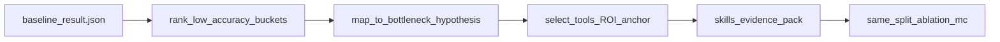

# Multimodal Agent — preliminary design (baseline → agent)

This note aligns the research direction with the **frozen baseline** under `baseline/`, **without relocating** data: clips and annotations stay under `Holistic_AVQA_bench/` (or `AV_SPEAKERBENCH_DATA_ROOT`).

## Goal

Use **native multimodal LMs** (e.g. Qwen3-Omni) as the core of an **Agent**, so audio / image / video understanding does not degrade through serial text-only pipelines and external format conversions where avoidable.

## Problem class

- Pure-text-centric agents depend on upstream tools → **conversion and segmentation errors** propagate.
- We focus on challenging **fusion** behaviors: ambiguous timing, simultaneous speakers, small or occluded visuals tied to utterances, etc.

### Representative challenging tasks (to refine)

| Theme | Sketch | Stress on model |
|--------|--------|------------------|
| **Multi-speaker overlap** | Who said what under overlap / quick turn-taking | Segmentation + speaker binding |
| **Local visual grounding** | “After X is visible / happens, …” anchored in complex scenes | Localisation + temporal scope |
| **Long / multi-event video** | When did Y happen relative to cue Z | Temporal reasoning, attention drift |

AV-SpeakerBench-style questions already encode **anchor–target** structure; the agent track can **extend** with controlled variants (length, overlap, clutter) while keeping **comparable** MC metrics where useful.

## Bottleneck analysis (workflow)

1. **Perception**: missed speech, wrong speaker, weak frame sampling.
2. **Alignment**: anchor time window wrong → all downstream answers wrong.
3. **Reasoning**: correct perception, wrong counting / comparison / duration.
4. **Tool boundary**: when to call a Skill vs rely on the LM — **interface error** and **double counting**.

Each failure mode should be logged with a small taxonomy (tags) for ablations.

## Skills & Tools (design principles)

- **Optional**: default path is “LM-only”; Skills are opt-in with explicit triggers.
- **Contract**: fixed input/output types (e.g. time ranges, speaker IDs, bounding boxes, transcript spans).
- **Examples** (not prescriptive): speech separation / diarization, ASR refresh, OCR, object / face detection, moment retrieval.

Implementation can wrap existing models or APIs; the **Agent layer** owns composition and **evidence fusion** back into the OMNI model.

## Implemented tools — agent track (engineering)

| Skill (registry) | Tool module | Default backend | Targets footnote |
|------------------|-------------|-----------------|------------------|
| `clip_span_meta` | [`../tools/benchmark_timecode.py`](../tools/benchmark_timecode.py) | — | Raw `start_time`/`end_time` plus parsed `start_s`/`end_s`/`span_s` (MM:SS) |
| `anchor_window_asr` | [`../tools/audio_asr.py`](../tools/audio_asr.py) | `auto` → faster_whisper / whisper / stub | `level 3: Speech Recognition, Speech Counting, Duration, Pitch, Rate, Intensity` (+ stem quotes); cite acc from your JSON |
| `lexical_asr_bridge` | ASR + stem quotes | same as anchor ASR | Stem quotes ∩ ASR windows (normalized substring); tags `hits_injected` / `no_hits`; synthetic if stub backend |
| `asr_word_lane` | [`../tools/audio_asr_words.py`](../tools/audio_asr_words.py) | `auto` → whisperx / faster_whisper / stub | Word timestamps for quote alignment, counting, and speaker-linked transcript slices |
| `anchor_quote_time` | [`../tools/audio_asr_words.py`](../tools/audio_asr_words.py) | same as word-lane ASR | First aligned timestamp for quoted phrase anchors in visual counting or quote-bounded tasks |
| `diar_binding` | [`../tools/audio_diar.py`](../tools/audio_diar.py) | `auto`; optional `pyannote` / `pyannote_api` / `stub` | `level 3: Speaker Recognition, Speaker Counting`; mechanism: perception/binding |
| `turn_order_sheet` | [`../tools/speech_turn_sheet.py`](../tools/speech_turn_sheet.py) | diar + word-lane merge | Ordered speaker-turn table for core speaker recognition and before/after questions |
| `viz_people_anchor` | [`../tools/video_people_snap.py`](../tools/video_people_snap.py) | ffmpeg + optional Ultralytics detect/track | `level 3: Visual Counting`; quote-aligned anchor time plus detector or tracker counts |
| — VAD (shared) | [`../tools/audio_vad.py`](../tools/audio_vad.py) | `auto` → Silero VAD / energy fallback | precondition for anchor ASR and localized quote evidence |

Replace accuracies in Targets lines using `rank_buckets_from_result.py` on your saved `result/*.json` (§ Evidence-from-baseline).

## Evidence-from-baseline (Skill / Tool prioritisation)

**Hard rule:** Every proposed Skill or Tool must cite **at least one baseline bucket** from your own `result/<model>.json` (see [`HARD_SUBSETS.md`](HARD_SUBSETS.md) for where files land under `baseline/` vs `agent/`). Do not prioritise from intuition alone.

### Primary vs secondary evidence

| Source | Use |
|--------|-----|
| **Primary** | Local `result/*.json` (and optionally `record/*.json` for error mining) from a **frozen** eval command (full or stratified — always document seed / fraction). |
| **Secondary** | Paper / leaderboard / VLMEvalKit published per-task numbers — **comparison only**. If they disagree with your JSON, **prefer your JSON** for design decisions and explain the gap. |

### Footnote convention (required in design notes)

When you add a Skill to this doc or to code comments, include a line of the form:

`Targets: level 3: <TaskId> (baseline acc=X%, n=total_from_JSON); mechanism: perception|alignment|reasoning|tool_boundary`

Level-2 buckets may be used similarly: `level 2: <SubCategory>(...)`.

Subset runs must add: `(subset: sample_fraction=..., seed=..., see _subset_meta in JSON)`.

### Operational steps

1. **Rank buckets** — Parse all keys `level 2: *` and `level 3: *` with structure `{matched,total,accuracy}`. Sort by **accuracy ascending**; focus on the **bottom ~25–40%** (or use `agent/scripts/rank_buckets_from_result.py`).
2. **Map bottlenecks** — For each weak bucket, label the dominant risk using the taxonomy in **Bottleneck analysis** above and the benchmark’s anchor–target design in the root [`README.md`](../../README.md).
3. **Assign Tool then Skill** — **Tool** = swappable backend (ASR, diarization, detector, OCR). **Skill** = ROI to anchor window, schema to text, failure fallback (`no_evidence` → pure Omni).
4. **Optional record study** — Sample N misses from weak buckets in `record/*.json` and tag failure mode before investing in heavy Tools.
5. **Ablate on the same split** — Agent runs must report the **same metric keys** as baseline; compare using `record/agent_trace_*.jsonl` joined on `question_id` where applicable.

### Flow (summary)

### Illustrative mapping (replace numbers from your JSON)

The table below is **format-only**; replace accuracies by re-running the ranking script on your saved `result/*.json`.

| Weak bucket (example key) | Typical bottleneck | Tool direction | Skill wrap |
|----------------------------|-------------------|----------------|------------|
| `level 3: Speech Counting` | alignment + counting | VAD/diarization + ASR on anchor window | Structured transcript table; no long prose |
| `level 3: Speaker Recognition` | perception / binding | Short diarization + optional face/id | Candidate speaker table tied to time |
| `level 3: Speech Pitch` / `Speech Rate` | perception granularity | Better aligned ASR / speaker spans first; avoid noisy proxy metrics by default | Compact timestamped evidence only |
| High-accuracy buckets (e.g. Speaker Detection) | — | **Deprioritise** Skills unless co-occurring with weak tasks | Conditional trigger only |

## Model & resource inventory

| Resource | Example | Role in agent track |
|----------|---------|---------------------|
| Native MM LM (API) | DashScope `qwen3.5-omni-plus-2026-03-15` | Default perception + reasoning backbone; consumes video/audio via API paths in `agent/model/closed/qwen3omni_api/`. |
| Native MM LM (local) | `--local_qwen_weights` | Same benchmark loop; heavier env; Skill outputs must fit model I/O caps. |
| Trace sink | `record/{eval_track}_trace_*.jsonl` | Per-row JSONL (`skills_invoked`, `bottleneck_tags`, `errors`, `infer_wall_ms`) when `AV_SPEAKERBENCH_EVAL_TRACK` is set (default **`agent`** in `agent/main.py`). |
| Skills (planned) | Separation, OCR, detection | Attached via `agent/orchestrator/runner.py`; disable with **`AV_SPEAKERBENCH_SKILLS=off`**. |

**Operational env (non-exhaustive):** `DASHSCOPE_API_KEY`, `DASHSCOPE_REGION`, `DASHSCOPE_OPENAI_*`, `AV_SPEAKERBENCH_EVAL_TRACK`, `AV_SPEAKERBENCH_DATA_ROOT`.

## Evaluation

- **Primary**: retain baseline-compatible **accuracy / breakdowns** on the same dataset split when comparing “LM-only agent” vs “LM + Skills”.
- **Secondary**: stability (variance across seeds / sampling), calibration of tool calls, and **human-audited** subsets on the hardest buckets.
- **Trace-derived**: tool / Skill failure rates, latency tails, correlate `bottleneck_tags` with wrong answers (`record/*trace*.jsonl` joined on `question_id`).

## Next steps (engineering)

1. **Skill registry** + real tools behind `augment_prompt_for_inference` (keep `noop_placeholder` behind env gate).
2. **Richer trace**: optional SHA-256 of prompt text, tool stderr snippets, per-Skill timings.
3. Optional **shared package** between `baseline/` and `agent/` if duplication cost exceeds maintenance (see `agent/README.md`).

---

*This file is a living design draft; freeze references for publications against a git tag on `baseline/`.*
